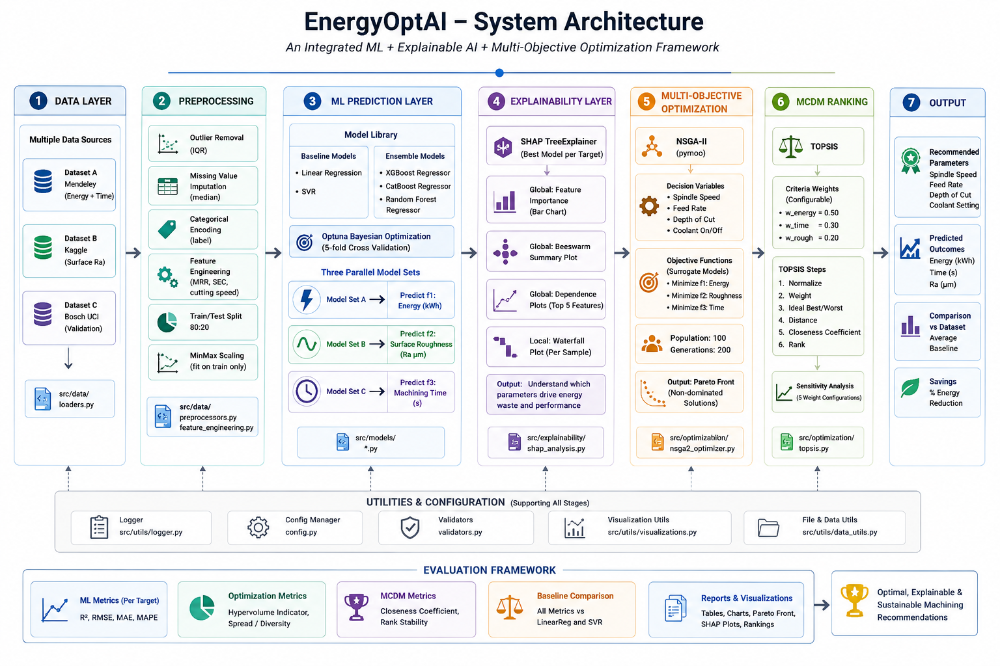
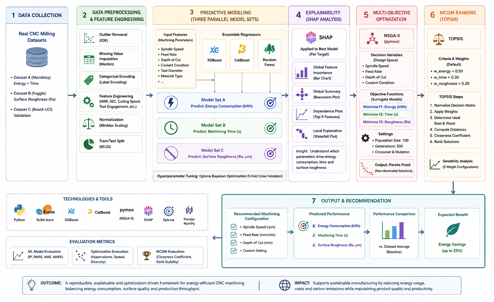

# EnergyOptAI

**Explainable Machine Learning and Multi-Objective Optimization Framework for Sustainable, Energy-Efficient CNC Machining**

[](https://www.python.org/)
[](https://opensource.org/licenses/MIT)

## Overview
EnergyOptAI is an integrated, open-source decision-support framework that bridges the gap between raw CNC machining telemetry and optimal parameter selection. It leverages tree-based machine learning ensembles as surrogate objective functions in a Non-dominated Sorting Genetic Algorithm II (NSGA-II) loop, paired with the Technique for Order Preference by Similarity to Ideal Solution (TOPSIS) multi-criteria decision-making (MCDM) method to recommend pareto-optimal cutting parameters.

## System Architecture


## Methodology Flowchart


### Key Features
1. **Heterogeneous Multi-Dataset Integration**: Combines public milling (Mendeley), turning (Kaggle), and UCI vibration (Bosch) databases into a unified search space with strict bound enforcement.
2. **Specific Energy Consumption (SEC) Target Engineering**: Isolates active cutting energy from spindle idle power using G-code block classification.
3. **SHAP-based Explainability**: Quantifies feature importances and conflict directions (e.g., feed rate vs surface roughness) using game-theoretic Shapley values.
4. **Tool wear scenarios**: Enforces tool wear as a process state variable (new, mid-life, worn tool states) rather than a controllable parameter.
5. **Decision Robustness**: Configures multi-criteria weights sensitivity analysis (balanced, energy-priority, quality-priority, time-priority, energy-time, default) with stability scoring.

---

## Project Structure
```text
energy-optimization-framework/
├── dataset/                     # Raw datasets (Kaggle, Mendeley, Bosch)
├── docs/                        # Project rules, architecture, and progress logs
├── outputs/
│   ├── figures/                 # Generated plots (EDA, residuals, Pareto, TOPSIS)
│   ├── models/                  # Pickled champion models and scalers
│   └── results/                 # Metrics CSVs, LaTeX tables, final recommendations
├── paper/                       # Manuscript draft, tables, and references
│   ├── figures/                 # Compilation of publication-quality figures
│   ├── sections/                # Separate LaTeX/Markdown paper sections
│   ├── manuscript.md            # Final combined paper draft
│   └── references.bib           # Citation database (20+ references)
├── scripts/                     # Execution, tuning, and optimization scripts
├── src/                         # Reusable core modules
│   ├── data/                    # Preprocessors, loaders, and feature engineering
│   ├── evaluation/              # Metrics calculation and statistical tests
│   ├── explainability/          # SHAP analyzers and cross-target conflicts
│   ├── models/                  # Estimator wrapper class definitions
│   └── optimization/            # NSGA-II, TOPSIS, and validation adapters
└── tests/                       # Complete unit test suite (pytest)
```

---

## Quick Start

### 1. Installation
This project uses `uv` for package management and environment synchronization.
```bash
# Clone the repository
git clone https://github.com/your-username/EnergyOptAI.git
cd EnergyOptAI

# Initialize virtual environment and sync dependencies
uv venv && uv sync
```

### 2. Run Training & Tuning
```bash
# Tune and train all regression models (CatBoost, XGBoost, Random Forest)
uv run python scripts/train_all_models.py
```

### 3. Run Explainability & Analysis
```bash
# Compute SHAP values and save global/local explanations
uv run python scripts/run_shap_analysis.py
```

### 4. Run Optimization & Decision Ranking
```bash
# Run multi-objective optimization across tool wear scenarios
uv run python scripts/run_optimization_scenarios.py

# Rank Pareto optimal solutions using TOPSIS MCDM and analyze sensitivity
uv run python scripts/run_topsis.py
```

---

## Quantitative Results

### Machine Learning Surrogates
* **Surface Roughness ($R_a$)**: CatBoost Champion ($R^2 = 0.8061$, $\text{RMSE} = 0.1237$ $\mu$m)
* **Machining Cycle Time ($CTime$)**: CatBoost Champion ($R^2 = 0.9947$, $\text{RMSE} = 1.1359$ s)
* **Energy Specific Energy Consumption (SEC)**: Random Forest Champion ($R^2 = 0.5002$, $\text{RMSE} = 13.1220$ J/mm³)

### Best Compromise Parameter Recommendation (TOPSIS default weight)
* **Feed Rate ($f$)**: 0.1037 mm/rev
* **Depth of Cut ($a_p$)**: 0.3357 mm
* **Spindle Speed ($S$)**: 10,201 rpm
* **Tool wear scenario**: Mid-life ($TCond = 0.053$ mm)

This compromise parameter configuration achieves a **4.2% predicted reduction in surface roughness** compared to the median baseline parameter configuration.

---

## Dataset Citations & Acknowledgements
If you use this framework in your research, please cite the underlying public datasets:

1. **Mendeley High-Frequency Energy Dataset**:
   * *Citation*: Brillinger, Markus (2025), “CNC Machining Data Repository - Geometry, NC Code & High-Frequency Energy Consumption Data for Aluminum and Plastic Machining”, Mendeley Data, V2, doi: `10.17632/gtvvwmz7r7.2`
   * *License*: CC BY 4.0

2. **Kaggle CNC Turning Quality Dataset**:
   * *Citation*: Canal, André Dorigueto and Borille, Anderson Vicente (2022), “CNC turning: roughness, forces and tool wear”, Kaggle Dataset, doi: `10.34740/KAGGLE/DS/2205074`
   * *License*: Kaggle Open Dataset Terms

3. **Bosch UCI Machining Accelerometer Dataset**:
   * *Citation*: Feil, M. (2022). Bosch CNC Machining Dataset [Dataset]. UCI Machine Learning Repository. doi: `10.1016/j.procir.2022.04.022`
   * *License*: CC BY 4.0 (Bosch Research)

---

## License
Distributed under the MIT License. See `LICENSE` for details.

